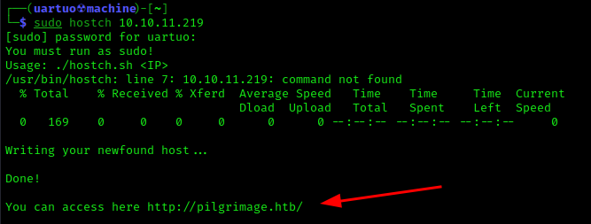
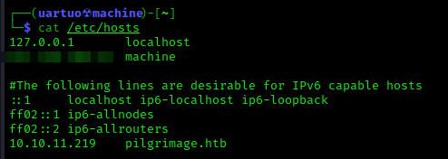

# hostch
Script simples em bash com a finalidade de automatizar o processo de descoberta e inserção de hostnames no sistema linux **(/etc/hosts)**.
O programa tem como foco CTFs no geral. Nos prints abaixo, utilizei a máquina 'Pilgrimage' do HackTheBox como exemplo:

**Modo de uso:**
`chmod +x hostch.sh`
`sudo ./hostch.sh <IP>`

**Modo de instalação:**
`chmod +x install.sh`
`sudo ./install.sh <IP>`
*Agora é só usar diretamente de qualquer lugar do sistema.*

## Como funciona?

- O programa faz uma requisição com o curl e descobre o hostname que o IP está tentando converter para redirecionar página.
- Através de um regex, separa tudo que está entre barras como demonstrado no exemplo a seguir '**/dominio.com/**' para ser o novo domínio e manda para um arquivo temporário chamado "dom".
- Adiciona o primeiro primeiro argumento (IP), um 'TAB' e o conteúdo de "dom" com o novo nome de host na última linha de /etc/hosts. 
- Printa o endereço disponível na tela e remove o arquivo temporário "dom".
